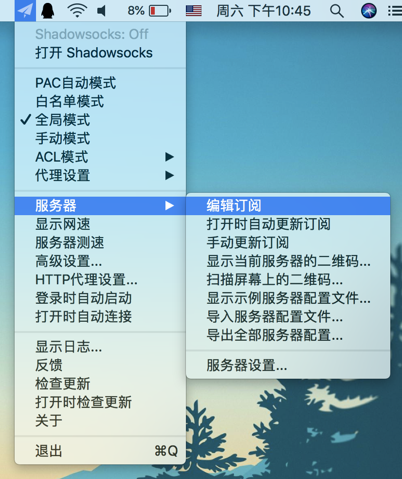
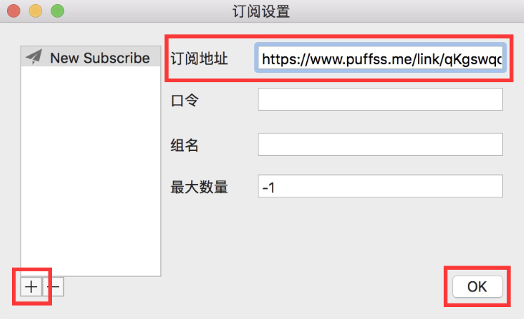
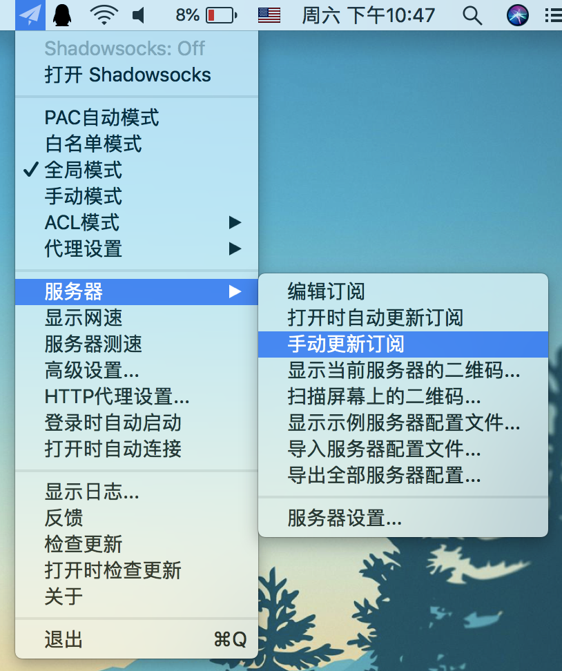

## 安装

下载[ShadowsocksX-NG-R8]，拖到应用里

## 配置

1. 在「服务器」选项中点击「编辑订阅」。

2. 点击左下角「+」添加订阅，把刚刚复制的订阅地址粘贴到「订阅地址」中，然后点击「OK」。

3. 在「服务器」选项中点击「手动更新订阅」。

[ShadowsocksX-NG-R8]: https://cdn.jsdelivr.net/gh/xcxnig/ssr-download/ssr-mac.dmg
