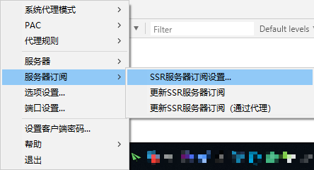
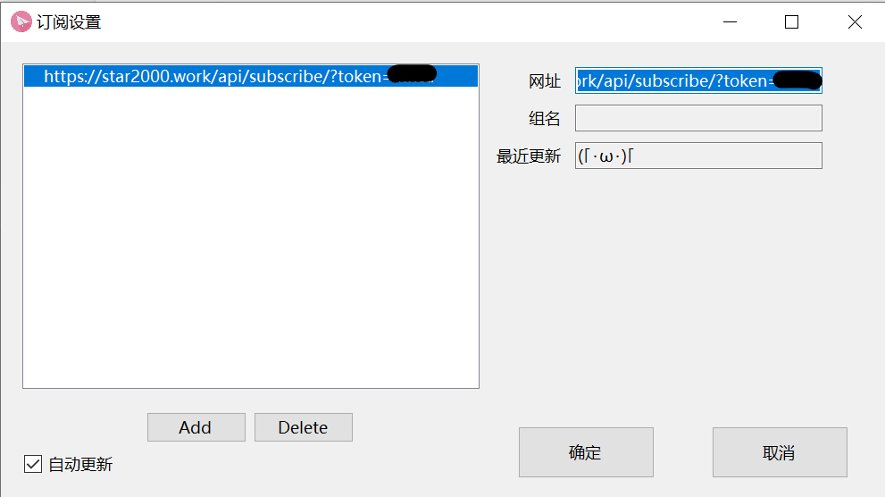
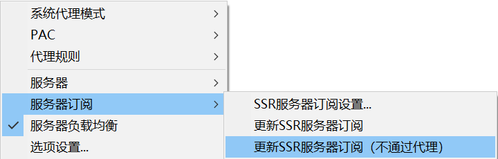

## 安装

下载[ShadowsocksR]，解压到任意位置

## 配置

1. 打开对应系统的软件，然后右击托盘栏的纸飞机图标，在「服务器订阅」选项中选择「SSR服务器订阅设置」。

2. 在弹出的窗口中，点击「Add」按钮，在右侧的网址输入框中粘贴节点订阅地址，点击「确定」。

3. 右击托盘栏纸飞机图标，在「服务器订阅」选项中选择「更新SSR服务器订阅（不通过代理）」。

4. 双击托盘栏纸飞机图标，选择以FreeSSR-public 开头的示例节点「删除(D)」，然后点击「确定」。
5. 右击托盘栏纸飞机图标，点击「选项设置」，勾选「开机启动」，然后点击「确定」。

[ShadowsocksR]: https://ssr-download.star2000.work/ssr-win.7z
