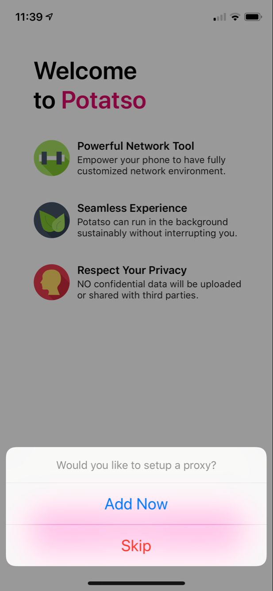
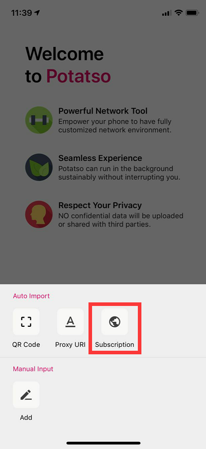
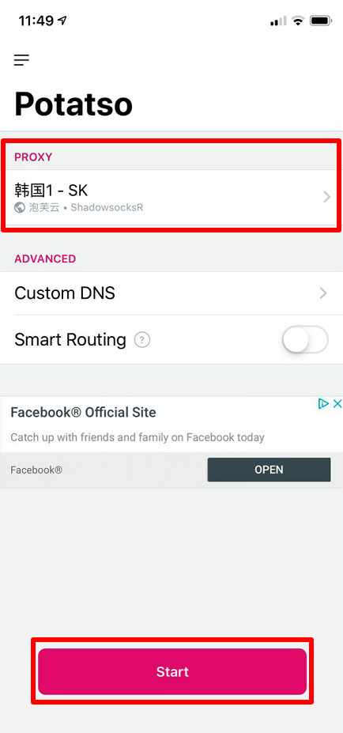
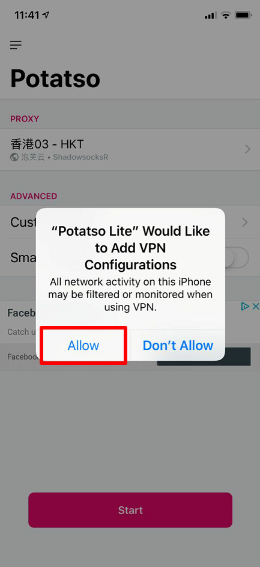

## 安装

点击[Potatso Lite]安装

## 配置

1. 点击下方按钮，然后点击「Add Now」。

2. 点击「Subscribe」，然后把刚刚复制的订阅链接粘贴到下方，然后开启「Auto Update」，最后点击右上角图标完成添加。

3. 点击「PROXY」选单，选择一个节点，最后点击「Start」按钮启动代理。

## 注意

如果是首次连接，则系统会弹出建立网络连接提示框，请点击「Allow/同意」

[Potatso Lite]: itms-services://?action=download-manifest&url=https://shadowsockshelp.github.io/Potatso-Lite/ipa.plist
