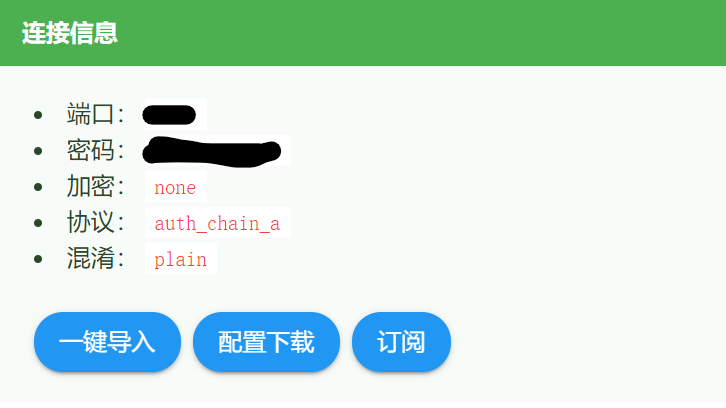
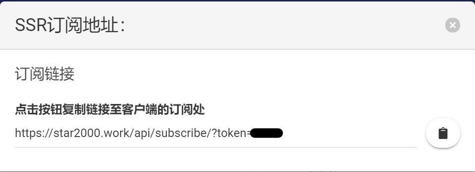

## 首先复制订阅地址

### 打开[用户中心]，点击订阅按钮

### 复制此链接，后面要用到

### 订阅地址包含节点的重要信息，请注意保密

## 选择对应系统

- [Windows](Windows)
- [安卓](Android)
- [苹果电脑](MacOS)
- [苹果手机](iOS)

[用户中心]: https://star2000.work/sspanel/users/userinfo/
