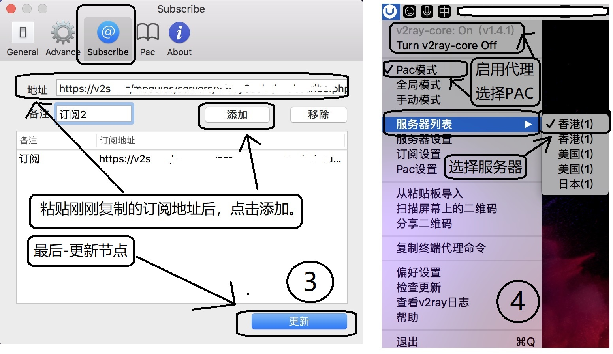

## 安装

- 方式一: 使用 homebrew 命令安装

```
brew cask install v2rayu
```

- 方式二: 下载最新版安装

<a href="https://xing2000.coding.net/p/blog/d/static/git/raw/master/V2rayU.dmg" download>V2rayU</a>

## 配置

1. 点击"订阅设置"
2. 粘贴订阅地址
3. "添加"并"更新"
4. 点击"PAC 模式"或"全局模式"


