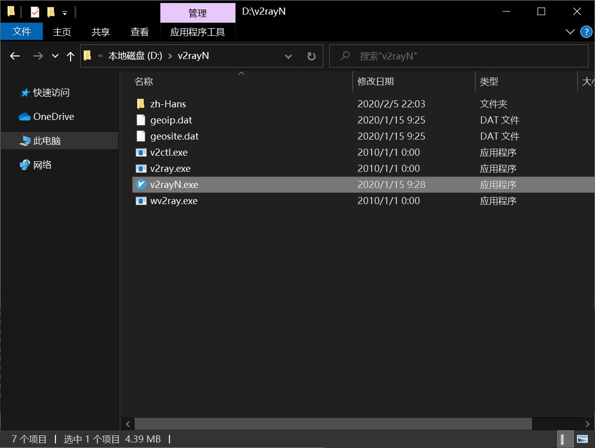
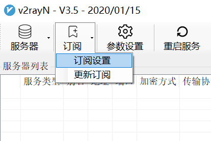
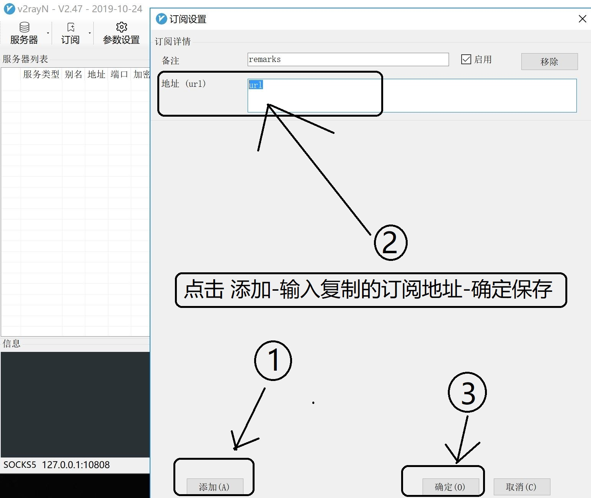
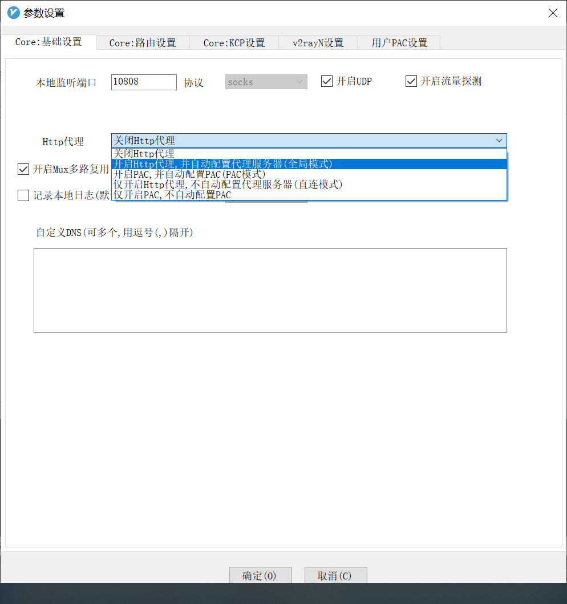
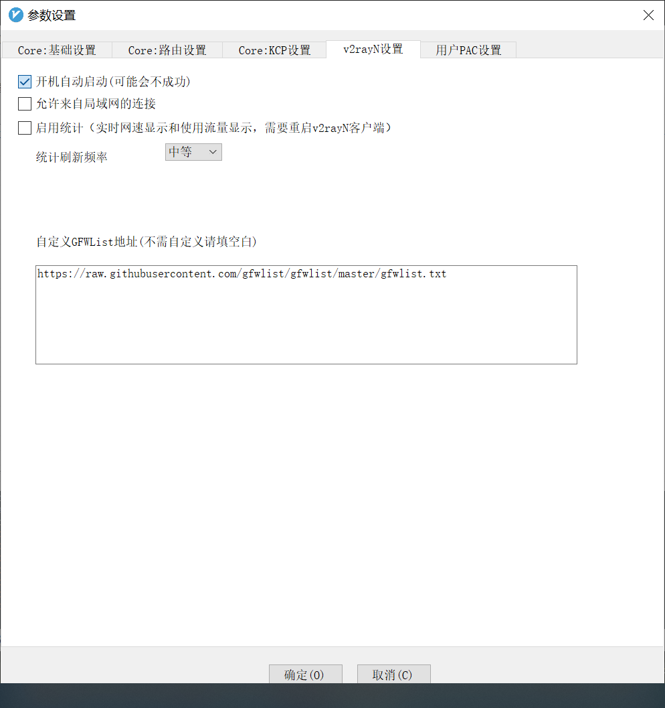

## 安装

下载<a href="https://xing2000.coding.net/p/static/d/static/git/raw/master/1.zip" download="v2rayN.zip">v2rayN</a>, 解压, 双击`v2rayN`

## 配置

1. "订阅">"订阅设置"

2. 点"添加", 粘贴"订阅地址", 点"确定"

3. "订阅">"订阅更新"
4. "参数设置">"Http 代理"改为"全局模式"

5. "v2rayN 设置">选中"开机自动启动", 点"确定"

